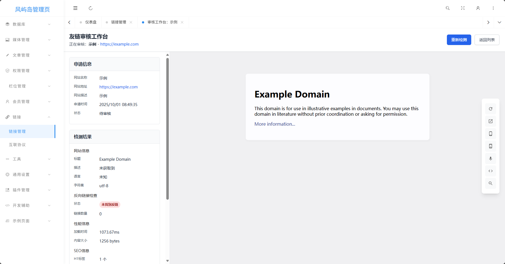
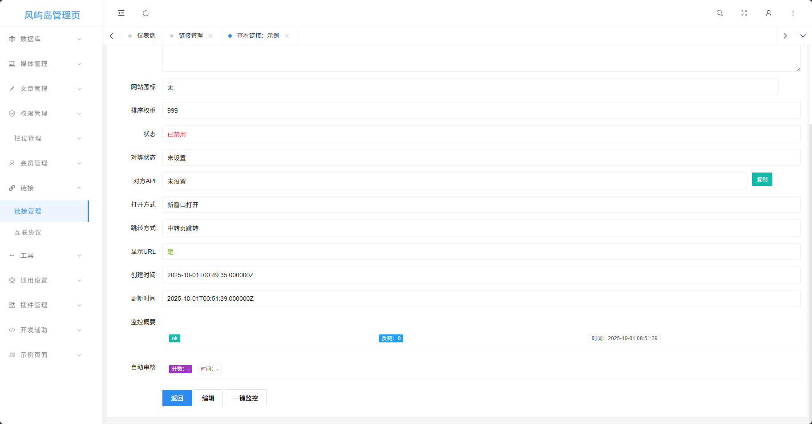
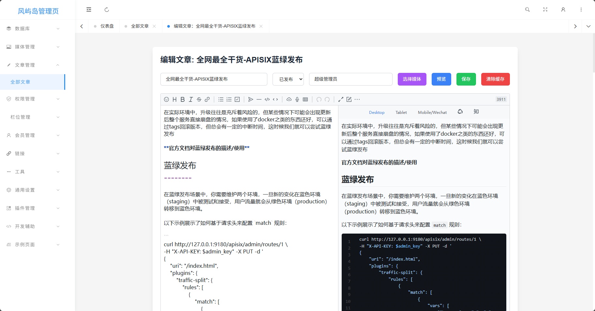

# Table of Contents

- [Table of Contents](#table-of-contents)
- [NOTE](#note)
- [Main Tech Stack](#main-tech-stack)
- [Overkill Everywhere](#overkill-everywhere)
- [Features to be Proud Of](#features-to-be-proud-of)
- [Features](#features)
- [Install & use](#install--use)

# NOTE

当你浏览这个项目，你可以看到:

- 一堆 AI 和一个人脑在互相博弈
- 大量的语法不统一
- 随处可见的 bug
- 各种不符合 PSR 规范
- 随处可见的安全漏洞
- 使用的依赖库达到了 60MiB
- 如何让执行效率变的很低
- 如何将 MySQL 项目硬改为 PGSQL 项目并且获得许多 bug

[doc](doc) 目录下的文档均由 AI 博弈而来

此项目是一个几乎不叫半成品的残次品，你甚至无法从后台设置中修改很多网站设置，而是需要前往数据库修改

# Main Tech Stack

- Webman
- Twig
- ES
- RabbitMQ

# Overkill Everywhere

ES 仅仅被用于搜索优化，这也许说得过去

但是因为友链的 callback 和监控功能，硬生生塞了一个消息队列到项目中

# Features to be Proud Of

一个由 GPT-5 编写的较为直观的同义词管理页


一个由 GPT-5 编写的友链审核页面



一个由 GPT-5 编写的看起来简单实则一点也不复杂的监控系统



一个由我和 AI 编写的使用了 Vditor 的编辑器



# Features

[TwigTemplateService.php](app/service/TwigTemplateService.php) 实现了 `Webman\View` 接口，添加了主题模板功能，会根据数据库中配置的主题信息选择进入哪个子目录

[CSRFService.php](app/service/CSRFService.php) 提供了 CSRF 令牌相关的功能，支持众多特性，包括一次性令牌，限时令牌，绑定到某个参数的令牌等，并且只要在控制器上添加注解即可启用 CSRF 验证

[CacheService.php](app/service/CacheService.php) 封装了 Redis 的功能，提供了缓存功能，目前仅支持 Redis 和 Null 缓存驱动，有 GPT-5 编写的貌似不能用的防止缓存穿透的设计，并且附带有缓存回退等高级功能

# Install & use

## Linux

如果使用宝塔面板等可直接安装 PHP 环境后使用命令行启动

```shell
# 克隆当前项目
git clone https://github.com/skyhhjmk/windblog.git && cd windblog

# 安装依赖
composer --no-dev install -vvv

# 启动
./webman start
```

如果您遇到了任何问题，请优先尝试运行修复命令以解除某些函数的禁用（会允许包括 exec 在内的多个函数）

```bash
./webman fix-disable-functions
```

当项目启动后，访问 `/app/admin` 即可看到安装页面（为了优化一点性能，首页并没有做安装检测）
是否安装的检测依据是根目录是否有 `.env` 文件，有则视为已安装并且使用文件中定义的环境变量运行