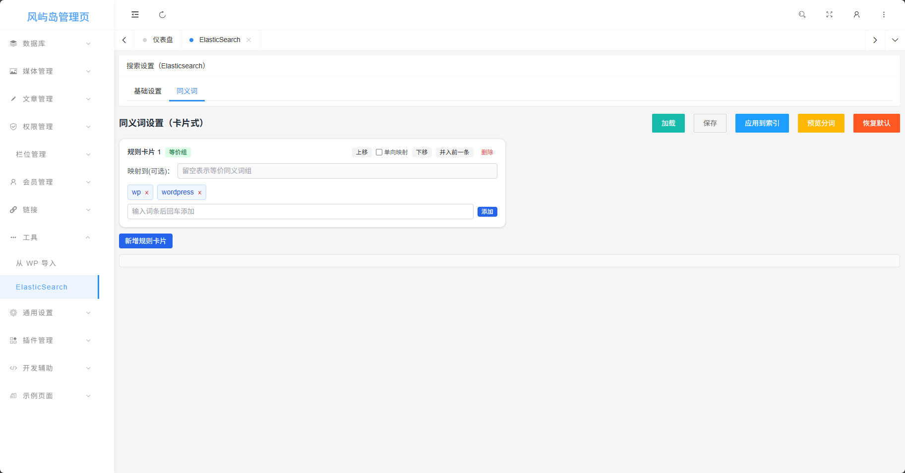

# Table of Contents

- [Table of Contents](#table-of-contents)
- [NOTE](#note)
- [Main Tech Stack](#main-tech-stack)
- [Overkill Everywhere](#overkill-everywhere)
- [Features to be Proud Of](#features-to-be-proud-of)
- [Features](#features)
- [Install & use](#install--use)

# NOTE

> Ads: 雨云 5 折优惠码 `github` ，绑定微信即可领取，aff 连接：[https://www.rainyun.com/github_](https://www.rainyun.com/github_)

> Ads: 云驰互联不定期零元购，aff 链接：[https://cloud.zyidc.net/aff/TKYFRZBG](https://cloud.zyidc.net/aff/TKYFRZBG)

> Ads: 毫秒镜像，好用的 Docker 镜像站，aff 链接：[https://1ms.run/?aff=2853](https://1ms.run/?aff=2853)

本项目版本号命名于 `1.0.0` 后开始遵循`语义化版本 2.0 规范`

当你浏览这个项目，你可以看到:

- 一堆 AI 和一个人脑在互相博弈
- 大量的语法不统一
- 随处可见的 bug
- 各种不符合 PSR 规范
- 随处可见的安全漏洞
- 使用的依赖库达到了 60MiB
- 如何让执行效率变的很低
- 如何将 MySQL 项目硬改为 PGSQL 项目并且获得许多 bug


[doc](doc) 目录下的文档均由 AI 博弈而来

此项目是一个几乎不叫半成品的残次品，你甚至无法从后台设置中修改很多网站设置，而是需要前往数据库修改

***本项目不适用于作为深度学习的训练数据集使用，因为这样做会使模型质量下降***

# Main Tech Stack

- Webman
- Twig
- ES
- RabbitMQ
- LLM(For development)

# Overkill Everywhere

ES 仅仅被用于搜索优化，这也许说得过去

友链的 callback 和监控功能、邮件发送、缓存生成等能使用事件或轮询的地方全部使用了消息队列

放着原本的高度继承的 MySQL 不用，硬生生顶着一堆 BUG 重构为了 PGSQL

# Features to be Proud Of

一个由 GPT-5 编写的较为直观的同义词管理页



一个由 GPT-5 编写的友链审核页面


一个由 GPT-5 编写的看起来简单实则一点也不复杂的监控系统


一个由我和 AI 编写的使用了 Vditor 的编辑器


# Features

[TwigTemplateService.php](app/service/TwigTemplateService.php) 实现了 `Webman\View` 接口，添加了主题模板功能，会根据数据库中配置的主题信息选择进入哪个子目录

[CSRFService.php](app/service/CSRFService.php) 提供了 CSRF 令牌相关的功能，支持众多特性，包括一次性令牌，限时令牌，绑定到某个参数的令牌等，并且只要在控制器上添加注解即可启用 CSRF 验证

[CacheService.php](app/service/CacheService.php) 封装了 Redis 的功能，提供了缓存功能，支持多种缓存驱动，有 GPT-5 编写的貌似不能用的防止缓存穿透的设计，并且附带有缓存回退等高级功能

[WordpressImporter.php](app/service/WordpressImporter.php) 和 [ImportProcess.php](app/process/ImportProcess.php) 实现了从 WordPress 导入的功能

[StaticGenerator.php](app/process/StaticGenerator.php) 实现了全站静态缓存生成的功能

[LinkMonitor.php](app/process/LinkMonitor.php) 实现了友链监控的功能

[MailWorker.php](app/process/MailWorker.php) 和 [MailService.php](app/service/MailService.php) 实现了多发信平台轮询使用的功能，并且提供发信失败自动隔离的功能

[DebugToolkit.php](app/middleware/DebugToolkit.php) 提供一个简易工具箱用于监测页面渲染时间、请求数据等，还提供一个简易请求发送工具

# Install & use

基本依赖：

- PostgreSQL
- PHP >= 8.2
- PHP PDO 扩展
- PHP pdo_pgsql 扩展

**由于追求较为极致的性能，首页并不存在安装检测的相关代码，首次启动需访问 `/app/admin` 进行安装，安装完成后请重启应用以实现扩展进程的资源初始化**

若要完整使用博客功能，请安装：

- PostgreSQL: 主要数据库（必须安装）
- Redis: 缓存数据库（可选安装）
- ElasticSearch: 全文索引数据库（可选安装）
- RabbitMQ: 消息队列（必须安装）

***本项目仍然处于开发阶段***

## Linux

如果使用宝塔面板等可直接安装 PHP 环境后使用命令行启动

```shell
# 克隆当前项目
git clone https://github.com/skyhhjmk/windblog.git && cd windblog

# 安装依赖
composer --no-dev install -vvv

# 启动
./webman start
```

如果您遇到了任何问题，请优先尝试运行修复命令以解除某些函数的禁用（会允许包括 exec 在内的多个函数）

```bash
./webman fix-disable-functions
```

当项目启动后，访问 `/app/admin` 即可看到安装页面（为了优化一点性能，首页并没有做安装检测）
是否安装的检测依据是根目录是否有 `.env` 文件，有则视为已安装并且使用文件中定义的环境变量运行